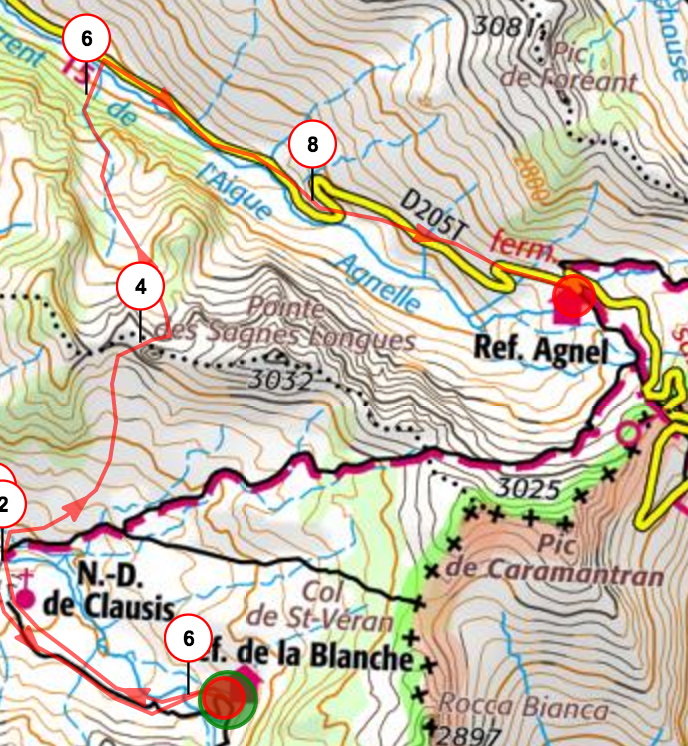
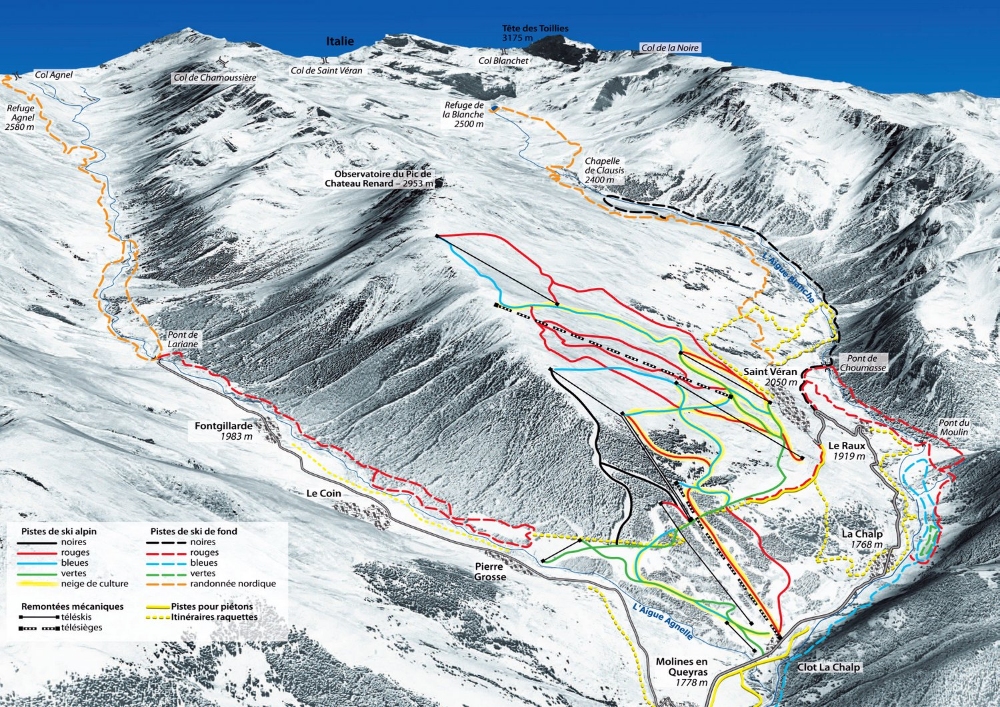

_Mini Tour dans le Queyras sur 3 jours_

## Etapes

### J1: Saint-Véran -> Refuge de la Blanche

- 6 km, 300 d+
- [GPX Jour1](j1.gpx)

### J2: Refuge de la Blanche -> Refuge Agnel

- 10 km, 850 d+
- [GPX Jour2](j2.gpx)

### J3: Refuge Agnel -> Fontgillarde

- 12 km, 650 d+
- [GPX Jour3](j3.gpx)

## Faisabilité

- Grenoble -> St Véran : 3h30
- [ ] appeler refuges pour nivologie
  - Refuge de la blanche (09 88 77 47 53 / 04 92 45 80 24) http://www.refugedelablanche.com/
  - Refuge Agnel (06 60 79 83 90) http://www.refugeagnel.com/
- [x] appeler office tourisme St Véran (04 92 45 82 21) 
- [ ] appeler remontées pour heure de fin
- [ouverture des pistes (alpin)](https://www.queyras-montagne.com/ouverture-pistes-ski-alpin.html#S1)
- [ouverture des pistes (nordique)](https://www.queyras-montagne.com/ouverture-pistes-ski-nordique.html)
- [webcams](https://www.queyras-montagne.com/webcam-queyras.html)

## Sécurité

- [ ] Repérage pentes sur carte 
- [x] Repérage pentes sur [skitrack](http://www.skitrack.fr/)
- [ ] Repérage difficultés (orientation, passages) itinéraires
- [x] Repérage topo de chaque étape sur [skitour](http://www.skitour.fr/)
- [ ] Check [BRA Queyras](http://www.meteofrance.com/previsions-meteo-montagne/bulletin-avalanches/queyras/OPP17) J-3/J-2/J-1
- [ ] Check [Météo](http://www.meteofrance.com/previsions-meteo-france/saint-veran/05350) J-3/J-2/J-1

## Logistique

- [ ] TC ? pour avoir 1 voiture a Fontgillarde et 1 à St Véran
- [ ] résa refuges
- [ ] info remontées mécaniques St Véran
